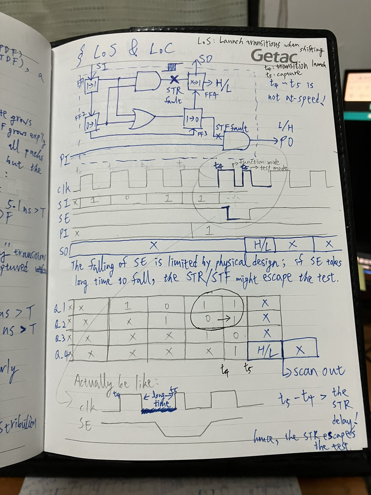
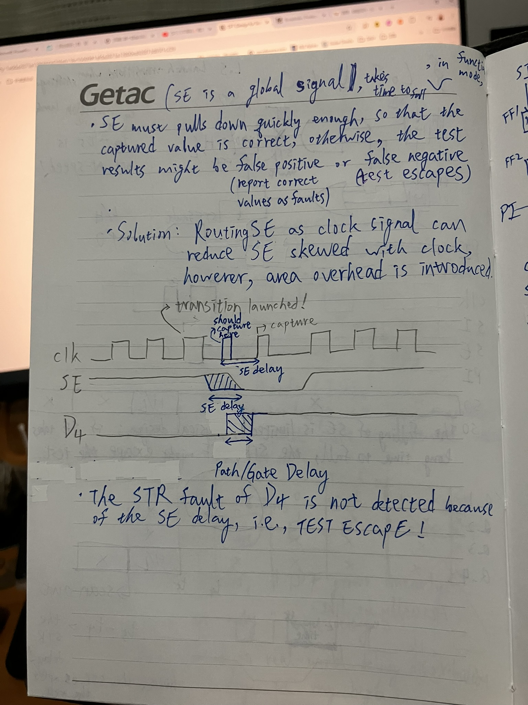
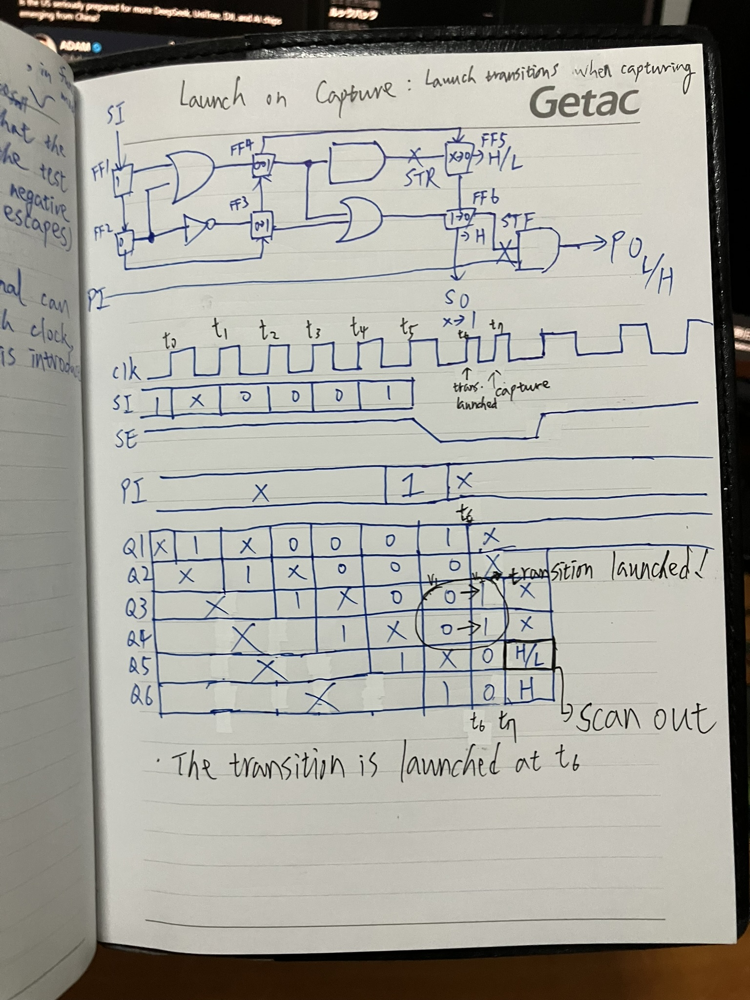

# DFT (Design for Testability)

## Contents
### [Fault Models](#fault-models)
* [Stuck-at Faults](#multiple-stuck-at-faults-msfs)
* [Bridging Faults](#bridging-faults-bfs)
* [Delay Faults](#delay-faults)
  
### [Quality of Testing (Fault Coverage, Defect-Level)](#quality-of-testing)
### [Scan Chain](#scan-chain)
* [Launch on Shift (LoS, Skewed-load Testing)](#los-launch-on-shift-skewed-load-test)
* [Launch on Capture (LoC, Broadside Testing)](#loc-launch-on-capture-broadside-test)
### [Test Pattern Generation (TPG) (Under Construction)](#test-pattern-generation-tpg)
* [LFSR](#lfsr)
* [MISR](#misr)
### [Build in Self Test (BIST) (Under Construction)](#bist)
* [LBIST](#lbist)
* [MBIST](#mbist)
### [Low-Power Testing (Under Construction)](#low-power-testing)
### Refenreces:
1. [Digital System Testing by Prof. Sying-Jyan Wang, National Chung Hsing University (NCHU)](https://vlsilab.cs.nchu.edu.tw/)
2. [VLSI Testing by Prof. James Chien-Mo Li, National Taiwan University (NTU)](https://www.youtube.com/playlist?list=PLvd8d-SyI7hjk_Ci0zpTqImAtpEjdK5JF)

## Why do we need DFT?

1. **Verify** the manufatured chips
2. Dimish system **cost**
   * Cost of repair goes up by an order of magnitude each step away from fab line

   1. Fab line (IC test):
      * Fab line is where the chips initially manufatured. At this stage, 
              the defects/faults are cheapest to identify and correct because they are 
              not packaged yet.
      * Tools like **automatic test equipment (ATE)** and **wafer-level testing (e.g., probe card)** are used here.
   2. Packaging: 
      * Chips are packaged and ready for integration into a system
   3. Board-level testing:
      * Packaged chips are integrated onto circuit boards. If a defect is discovered, the entire board may have to be discard.
   4. System-level testing:
      * Boards are integrated into a system or device.
   5. In the field (End-user stage)
3. Improve system **reliability** (prevent errors occur)

# Logic Simulation

### Hign-impedance & unknown value

[https://www.figma.com/design/kP5fJFrKxJzpsKAo1HYPrU/Untitled?node-id=0-1&t=srQhWGj7N09IJLaM-1](https://www.figma.com/design/kP5fJFrKxJzpsKAo1HYPrU/Untitled?node-id=0-1&t=srQhWGj7N09IJLaM-1)

### Ternary Logic is not accurate

- Whether B is 0 or 1, K will always be 0.
  
    
   
- Resolution:
    
    
    

### Input Scannign algorithm

- Using **truth table** takes **huge memory** to determine the output value of logic gates
- Not Efficient for multi-input logic gates

- By scanning ***controlling values*** and ***unknown values***, efficiently determine the gate output in **logic simulation**
    
    
    

# Fault Models

- Def: **The methods (models) used to determine whether the target faults exist in the CUT**

### Defect → Fault → Error → Failure

## Why Fault Modeling?

## SSF
* One signal line (net) in the network of logic gates is fixed to logic 0 or logic 1
  * 2 SSFs (s@1 or s@0) per node
* Short Circuits: A short between a node and power (Vdd) or ground (Gnd)
* Impurities: During fabrication, dust particles can disrupt circuit behavior and result
* Physical Damage:
  * Thermal Stress:
      * Excessive heat can damage transistors or interconnects, causing permanent faults.
  * Mechanical Damage:
      * Handling errors, such as during packaging or mounting on a PCB, can damage the circuit and lead to faults.

## Multiple Stuck-at Faults (MSFs)

- Each node got 3 possible states: sa1, sa0, fault-free
- Single stuck-at fault model can detect most of the MSFs (except for the masked faults)
    - Fault Masking: Fault f2 mask fault f1, if 
    A test for f1 fails to detect f2, in the presense of f2.

## Bridging Faults (BFs)

- **Fault extraction**: There’re too many BFs in a circuit, so we need a physical tool to inspect where is more likely to have BFs due to neighbor signals

- BF does not consider Shorts to power or ground (they are counted as s@ faults)
- BF does not consider intra-cell (intra-gate) defects, because BF is gate-level, not transistor-level fault model
- BF does not distinguish b/w **fanout stem** and **branches (unlike s@ faults)**
    - E.g., Both the input of $G_2$   are $A*(B+C)$, so $G_2$  is quivalent to a logic 1

- BF is **not transient fault,** it is a **Permanent faults**
    - **Transient fault**: Not always present, which is induced by environmental (Electromagnetic interference , EMI) or internal (IR drop) disturbance
        - E.g., crosstalk faults caused by coupling effect
    - **Permanent faults**: Faults that always present; caused by defects, e.g., particle defects

### Wired-OR/-AND Models

### SSF Test Sets for BFs

- Not good enough, because **the feedback BFs are not detected**
- We have to apply wire-OR/-AND BF models to detect the feedback BFs

## Delay Faults

Slow-to-fall delay falut

- Crosstalk: Design mistakes which the two wires are put too close to each other
- How to detect delay faults?
    - Global delay fault: Test the frequency of the monitor
    
    
    
    - Local delay fault

### Path Delay Fault (PDF) model

- Assume that there’re small delay fault (extra time) distribuited along paths
    - **It is a more realistic model, compared to the TDF model**
- The distributed faults slow down the signal, and cause the signals operating in wrong speed (consequently the signals will not be read at right time)
- More accurate, but complicated
- Two PAFs for **each PATH**: Rising ↑ & Falling ↓
    - Number of total faults: In worst-case, taking exponential time to exaustively test all paths, so usually only the paths on the **path-list** are considered
    
    
    

### Transition Delay Fault (TDF) model

- Assume there is  a large fault (extra time) lumped at a node (site)
- Only focusing on the fault site, no need to consider the path delay
- Simple, but not accurate
- Two TDFs for **each** **NODE:** Slow-to-Rise (STR) fault & Slow-to-Fall (STF) fault
    - Number of total faults: **Linear** to circuit size
- Comparison
    - PDF model is more accurate, but complicated to implement for ATPG;
    - TDF is less accurate, so it is easier for ATPG
    
    
    

## **Limitations of Fault Models** (**Unmodeled Faults)**

- Def: While achieving **100% FC for a specific fault model** (e.g., stuck-at faults) ensures all faults of that type are tested, it **does not guarantee the detection of faults or errors outside the scope of that model**.
- **Root Cause**: Faults are actually **ABSTRACTIONs of the defects**, so faults can’t 100% reflect the physical-level defects in digital ciruits
- Real-World Defects Beyond the Model: **Manufacturing defects** or **environmental issues**
    - Process Variation, e.g., timing variation causes timing violations
    - Aging-related issues (electromigration, time-dependent dielectric breakdown).

# Quality of Testing

## FC & DL (DPM)

$Fault\ Coverage=\frac{The\ number\ of\ Detected\ Faults} {The\ number\ of\ Total\ Faults}$
- The fraction of faults not detected by the testing process (missed faults by the test set)
  
$Defect\ Level = 1 - Y^{1-FC}$ (*Brown & Williams* **Model**)
- It’s a model for **PREDICTING** the **% of Test Escape**
- The probability that a defective chip remains undetected and is shipped as a "good" chip

# ATPG

# SCAN CHAIN

## Design Rule Check (DRC)

## Gated Clock

- Use FF, so the enable must hold long enough to start pulsing the clock
- Only start pulsing the clock when SE in up

### Combinational Feedback Loop

## Scan Cell (Flip-Flop, Latch)

- If SE is up (enter test mode), the data of SFF is updated from the previous SFF; otherwise, it comes from the combinational logic.
- We can observe faults in scan-output or the primary output (PO)
- SFF has two functions: ***shift*** and ***capture***

### Control Points

- Overhead: An Extra MUX and a DFF
- SFF: DFF + MUX

### Observation Points

- Overhead: An Extra MUX and a DFF
- SFF: MUX + DFF
- Pulse one clock to load the data into DFFs, then set SE=1 and scan out the data

## Crossing Clock Domain

- If $CK_2$ is behind $CK_1$, $CK_2$ will miss the data generated by $SC_p$ from the previous clock

### Solution_1: ***Lock-up Latch***

### Solution_2: Clock Grouping

- If two clock domains have a lots interaction (long comb circuit b/w them), they might have large ***clock skew*** b/w them, so they cannot form a scan chain.
- That means we have to find the CDs which have NO interaction b/w them

### Mixed negedge-/posedge-FFs

## LoS & LoC (Detecting Delay Faults)

### LoS (Launch on Shift, Skewed-load Test)

- The transition is launched at $t_4$ (while in TEST MODE, aka SHIFTING TESTING PATTERNS)
- Procedure of LoS:
    1. Test Mode (Slow clock)
        1. To initiate the transition, scan-in the first vector in FFs in test mode ($t_0$ to $t_3$)
        2. To launch the transition, pulse one more clock to obtain the second vector 
            - The transition is launched at $t_4$ while **the FFs are capturing data from the preceding FFs, where the FFs are shifting data**, hence it’s called LAUNCH **ON SHIFT**
        3. Deassert SE, enter function mode (fast clock)
    2. Function Mode
        1. Pulse one clock to **capture** the test result (H/L) in FF4
        2. Assert SE, go back to test mode to scan-out the H/L in FF4
    3. Test Mode
        1. Pulse the clock to scan-out the result
- Since SE is a global signal, consequently, to de/assert the signal, it might suffer from long delay as it takes time from the PI to the FFs, then cause incorrect test result (false positive or false negative).
    - If SE pull-down dealy > path/gate delay, the capture clock cannot capture the fault.
        
        
        

### LoC (Launch on Capture, Broadside Test)

- Broadside: 舷側

- In Pirates of the Caribbean:

[https://www.youtube.com/watch?v=PEaZ5XUe0Mk](https://www.youtube.com/watch?v=PEaZ5XUe0Mk)

- Procedure of LoC:
    1. Test Mode (Slow clock)
        1. To **initiate** the transition, scan-in the first vector in FFs in test mode ($t_0$ to $t_5$) ↔ **Load bombs into cannons**
        2. Deassert SE, enter function mode (fast clock)
    2. Function Mode (Fast clock)
        1. To **launch** the transition, pulse one clock to obtain the second vector in FF3 & FF4 ↔ Fire the cannons
            - The transition is **launch at $t_6$**, i.e., **launch while the FFs are capturing data from the preceding combinational logics**, **hence it’s called LAUNCH ON CAPTURE**
        2. Pulse one more clock to **capture** the test result (H/L) in FF5 ↔ Fire one more time
        3. Assert SE, go back to test mode to scan-out H/L in FF5
    3. Test Mode
        1. Pulse the clock to scan-out the result

# Test Pattern Generation (TPG)
## LFSR
## MISR
## Compression
## Decompression

# BIST

## MBIST

## LBIST

# Low-Power Testing

## Reduce the Number of Transitions

- For the sake of reducing the number of test patterns, the generated test patterns often frequently toggle, e.g., 0000→1111, 0101→1010, etc.
- The patterns generated by ATPG are random, so the correlation b/w them is low; unlike the input of a circuit is often high, .e.g, speech signal.

## Low-Power Test Pattern Generation

- **Description**: Generate test patterns that minimize the simultaneous toggling of signals.
- **Benefits**:
    - Reduces power peaks during testing.
    - Prevents overloading the power delivery network, minimizing IR drops and thermal effects.
- **Techniques**:
    - **Capture Power Reduction**: Modify patterns to reduce simultaneous switching during the capture cycle of scan-based tests.
    - **ATPG Optimization**: Use power-aware Automatic Test Pattern Generation (ATPG) tools to generate patterns that balance fault coverage and power consumption.

## Dynamic Power Management During Testing

- **Description**: Incorporate dynamic power management techniques used during normal operation into the test mode.
- **Implementation**:
    - Enable power gating to selectively turn off unused blocks of the chip during testing.
    - Use clock gating to disable clock signals in inactive portions of the circuit during specific test cycles.
- **Benefits**:
    - Reduces unnecessary power draw in unused parts of the circuit.
    - Controls peak power consumption during testing.

## Partitioned Testing

- **Description**: Test smaller subsections of the chip incrementally, rather than the entire chip at once.
- **Implementation**:
    - Divide the circuit into smaller functional blocks or regions and test them one at a time.
    - Use techniques like hierarchical DFT (Design for Testability) to facilitate partitioned testing.
- **Benefits**:
    - Limits the area under test at any given time, reducing power consumption.
    - Prevents excessive thermal stress and overheating.

## **Scan Chain Design for Power Efficiency**

- **Description**: Optimize the design of scan chains to balance testing efficiency and power usage.
- **Techniques**:
    - **Segmented Scan Chains**: Divide scan chains into smaller segments and test each segment independently, reducing simultaneous toggling.
    - **Clocking Strategies**: Use multiple slower clocks rather than a single high-frequency clock to reduce dynamic power.

## **Test Scheduling Optimization**

- **Description**: Arrange the order of tests to minimize peak power usage while maintaining fault coverage.
- **Approaches**:
    - Alternate between high-power and low-power test patterns to distribute power usage more evenly.
    - Avoid consecutive high-power test patterns that may lead to overheating or excessive IR drop.
- **Tools**:
    - Use power-aware test scheduling algorithms to automate this process.

## **Built-In Self-Test (BIST)**

- **Description**: Use power-efficient on-chip self-testing mechanisms to reduce dependency on external test equipment.
- **Benefits**:
    - Limits power usage by controlling the test environment more effectively.
    - Reduces the complexity of test patterns as the test engine is integrated into the chip.
