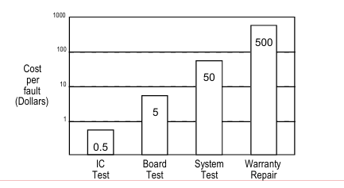

# DFT (Design for Testability)

[Logic Simulation](#logic-simulation-1)

[Quality of Testing (Fault Coverage, Defect-Level)](#quality-of-testing)

[ATPG](#atpg)

* [Design Rule Checks (DRCs)](#design-rule-check-drc)

[Fault Model](DFT%20(Design%20for%20Testability)%201adda2873a1280999d76fe6138c55609/Fault%20Model%201b7da2873a128083a27af161730f8e36.md)

[Scan Chain](DFT%20(Design%20for%20Testability)%201adda2873a1280999d76fe6138c55609/Scan%20Chain%201b7da2873a12808097ecfd7156f4976b.md)

[BIST](DFT%20(Design%20for%20Testability)%201adda2873a1280999d76fe6138c55609/BIST%201b7da2873a128090aeb8d4b744e7b9e8.md)

[Low Power Testing](DFT%20(Design%20for%20Testability)%201adda2873a1280999d76fe6138c55609/Low%20Power%20Testing%201b7da2873a12804299ccd8065cbe3ad3.md)

[References](#references-1)

## Why do we need DFT?

1. **Verify** the manufatured chips
2. Dimish system **cost**
   * Cost of repair goes up by an order of magnitude each step away from fab line

   1. Fab line (IC test):
      * Fab line is where the chips initially manufatured. At this stage, 
              the defects/faults are cheapest to identify and correct because they are 
              not packaged yet.
      * Tools like **automatic test equipment (ATE)** and **wafer-level testing (e.g., probe card)** are used here.
   2. Packaging: 
      * Chips are packaged and ready for integration into a system
   3. Board-level testing:
      * Packaged chips are integrated onto circuit boards. If a defect is discovered, the entire board may have to be discard.
   4. System-level testing:
      * Boards are integrated into a system or device.
   5. In the field (End-user stage)
3. Improve system **reliability** (prevent errors occur)

# Logic Simulation

### Hign-impedance & unknown value

[https://www.figma.com/design/kP5fJFrKxJzpsKAo1HYPrU/Untitled?node-id=0-1&t=srQhWGj7N09IJLaM-1](https://www.figma.com/design/kP5fJFrKxJzpsKAo1HYPrU/Untitled?node-id=0-1&t=srQhWGj7N09IJLaM-1)

### Ternary Logic is not accurate

- Whether B is 0 or 1, K will always be 0.
    
    
    
- Resolution:
    
    
    

### Input Scannign algorithm

- Using **truth table** takes **huge memory** to determine the output value of logic gates
- Not Efficient for multi-input logic gates

- By scanning ***controlling values*** and ***unknown values***, efficiently determine the gate output in **logic simulation**
    
    
    

# Quality of Testing

## FC & DL (DPM)

- $Fault\ Coverage=\frac{\#Detected\ Faults} {\#Total\ Faults}$
    - The fraction of faults not detected by the testing process (missed faults by the test set)
- $Defect\ Level = 1 - Y^{1-FC}$ (*Brown & Williams* **Model**)
    - It’s a model for **PREDICTING** the **% of Test Escape**
    - The probability that a defective chip remains undetected and is shipped as a "good" chip

# ATPG

## Design Rule Check (DRC)

## Gated Clock

- Use FF, so the enable must hold long enough to start pulsing the clock
- Only start pulsing the clock when SE in up

### Combinational Feedback Loop

# References:
1. [Digital System Testing by Prof. Sying-Jyan Wang, National Chung Hsing University (NCHU)](https://vlsilab.cs.nchu.edu.tw/)
2. [VLSI Testing by Prof. James Chien-Mo Li, National Taiwan University (NTU)](https://www.youtube.com/playlist?list=PLvd8d-SyI7hjk_Ci0zpTqImAtpEjdK5JF)